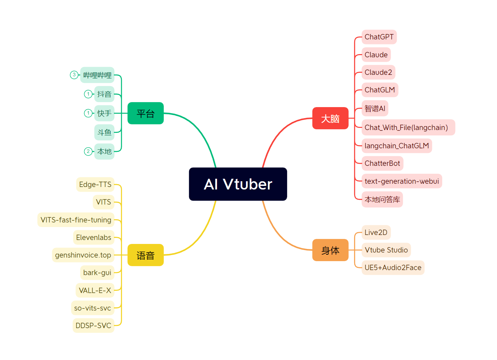

# ✨ Luna AI ✨

Luna AI 是一个由

`ChatterBot / GPT / Claude / langchain 本地 or 云端 / chatglm / text-generation-webui / 讯飞星火 / 智谱AI`

做为 `大脑` 驱动的虚拟主播 `Live2D / Vtube Studio / UE5 + Audio2Face` ，可以在 Bilibili/抖音/快手/斗鱼 直播中与观众实时互动 或者 直接在本地和您进行聊天

它使用自然语言处理和文本转语音技术 `Edge-TTS / VITS-Fast / elevenlabs / bark-gui / VALL-E-X` 生成对观众问题的回答并可以通过 `so-vits-svc / DDSP-SVC` 变声

另外还可以通过特定指令协同 `Stable Diffusion` 进行画图展示。并且可以自定义文案进行循环播放

`本项目完全免费，如有发现一模一样的套壳售卖程序，皆为盗版，请及时止损`

<a href="//space.bilibili.com/3709626/channel/collectiondetail?sid=1422512" target="_blank">▶︎ 视频教程合集</a>
 | 
<a href="//ai.ie.cx">📄 在线文档</a>
 | 
<a href="//github.com/Ikaros-521/AI-Vtuber" target="_blank">🍉 GitHub</a>
 | 
<a href="//gitee.com/ikaros-521/AI-Vtuber" target="_blank">🍓 Gitee</a>

