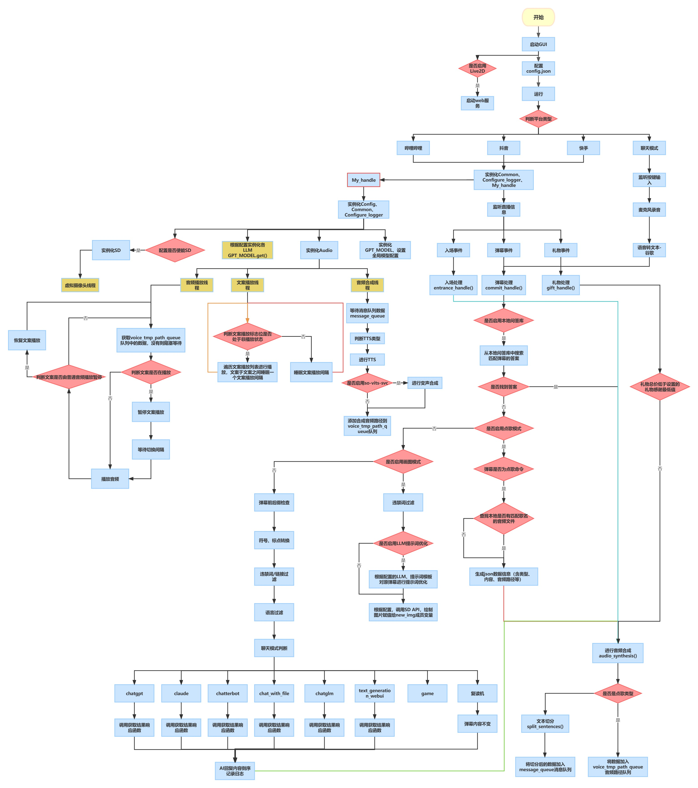

# AI Vtuber


<div style="text-align: center;">
<h1>✨ AI Vtuber ✨</h1>
<a href="https://github.com/Ikaros-521/AI-Vtuber/stargazers">
    
</a>
<a href="https://github.com/Ikaros-521/AI-Vtuber/issues">
    
</a>
<a href="https://github.com/Ikaros-521/AI-Vtuber/network">
    
</a>
<a href="./LICENSE">
    
</a>
<a href="https://www.python.org">
    
</a>


<p>
AI Vtuber是一个由 ChatterBot/GPT/Claude/langchain本地or云端/chatglm/text-generation-webui/讯飞星火 做为"大脑"驱动的虚拟主播（Live2D/Vtube Studio），可以在 Bilibili/抖音/快手 直播中与观众实时互动 或者 直接在本地和您进行聊天。
它使用自然语言处理和文本转语音技术(Edge-TTS/VITS-Fast/elevenlabs)生成对观众问题的回答并可以通过so-vits-svc/DDSP-SVC变声；另外还可以通过特定指令协同Stable Diffusion进行画图展示。并且可以自定义文案进行循环播放。 
</p>

<span style="vertical-align: super;">
<a href="https://space.bilibili.com/3709626/channel/collectiondetail?sid=1422512" target="_blank">视频教程合集</span></a>

</div>


## 🕺🏻目录
<!-- START doctoc generated TOC please keep comment here to allow auto update -->
<!-- DON'T EDIT THIS SECTION, INSTEAD RE-RUN doctoc TO UPDATE -->


- [📖项目结构](#%E9%A1%B9%E7%9B%AE%E7%BB%93%E6%9E%84)
- [下载项目](#%E4%B8%8B%E8%BD%BD%E9%A1%B9%E7%9B%AE)
- [💿运行环境](#%E8%BF%90%E8%A1%8C%E7%8E%AF%E5%A2%83)
- [🔧配置](#%E9%85%8D%E7%BD%AE)
  - [chatgpt代理](#chatgpt%E4%BB%A3%E7%90%86)
  - [chat_with_file 模式说明](#chat_with_file-%E6%A8%A1%E5%BC%8F%E8%AF%B4%E6%98%8E)
    - [模式简介](#%E6%A8%A1%E5%BC%8F%E7%AE%80%E4%BB%8B)
    - [模式配置](#%E6%A8%A1%E5%BC%8F%E9%85%8D%E7%BD%AE)
      - [注意](#%E6%B3%A8%E6%84%8F)
- [🎉使用](#%E4%BD%BF%E7%94%A8)
  - [哔哩哔哩版](#%E5%93%94%E5%93%A9%E5%93%94%E5%93%A9%E7%89%88)
  - [抖音版](#%E6%8A%96%E9%9F%B3%E7%89%88)
  - [抖音版_旧版（不稳定）](#%E6%8A%96%E9%9F%B3%E7%89%88_%E6%97%A7%E7%89%88%E4%B8%8D%E7%A8%B3%E5%AE%9A)
  - [快手版](#%E5%BF%AB%E6%89%8B%E7%89%88)
  - [斗鱼版](#%E6%96%97%E9%B1%BC%E7%89%88)
  - [聊天模式](#%E8%81%8A%E5%A4%A9%E6%A8%A1%E5%BC%8F)
- [🃏效果图](#%E6%95%88%E6%9E%9C%E5%9B%BE)
  - [GUI界面](#gui%E7%95%8C%E9%9D%A2)
    - [配置页](#%E9%85%8D%E7%BD%AE%E9%A1%B5)
    - [运行页](#%E8%BF%90%E8%A1%8C%E9%A1%B5)
    - [文案页](#%E6%96%87%E6%A1%88%E9%A1%B5)
    - [聊天页](#%E8%81%8A%E5%A4%A9%E9%A1%B5)
  - [SD接入](#sd%E6%8E%A5%E5%85%A5)
- [❓️FAQ 常问问题](#%EF%B8%8Ffaq-%E5%B8%B8%E9%97%AE%E9%97%AE%E9%A2%98)
  - [部署过程问题](#%E9%83%A8%E7%BD%B2%E8%BF%87%E7%A8%8B%E9%97%AE%E9%A2%98)
    - [1.CondaSSLError: OpenSSL appears to be unavailable on this machine](#1condasslerror-openssl-appears-to-be-unavailable-on-this-machine)
    - [2.ModuleNotFoundError: No module named 'xxx' 大同小异](#2modulenotfounderror-no-module-named-xxx-%E5%A4%A7%E5%90%8C%E5%B0%8F%E5%BC%82)
      - [ModuleNotFoundError: No module named 'PyQt5'](#modulenotfounderror-no-module-named-pyqt5)
      - [ModuleNotFoundError: No module named 'langid'](#modulenotfounderror-no-module-named-langid)
      - [ModuleNotFoundError: No module named 'profanity'](#modulenotfounderror-no-module-named-profanity)
      - [ModuleNotFoundError: No module named 'ahocorasick'](#modulenotfounderror-no-module-named-ahocorasick)
  - [使用过程问题](#%E4%BD%BF%E7%94%A8%E8%BF%87%E7%A8%8B%E9%97%AE%E9%A2%98)
    - [1.openai 接口报错:《empty message》](#1openai-%E6%8E%A5%E5%8F%A3%E6%8A%A5%E9%94%99empty-message)
    - [2.ERROR: Cannot install -r requirements_bilibili.txt (line 23), aiohttp and langchain==0.0.142 because these package versions have conflicting dependencies.](#2error-cannot-install--r-requirements_bilibilitxt-line-23-aiohttp-and-langchain00142-because-these-package-versions-have-conflicting-dependencies)
    - [3.ERROR: Conmunicate.`__init__`() got an unexpected keyword argument 'text'](#3error-conmunicate__init__-got-an-unexpected-keyword-argument-text)
    - [4.File ".\flask_api_full_song.py", line 38, in wav2wav  out_audio, out_sr = svc_model.infer(spk, tran, raw_path) ValueError: too many values to unpack (expected 2)](#4file-%5Cflask_api_full_songpy-line-38-in-wav2wav--out_audio-out_sr--svc_modelinferspk-tran-raw_path-valueerror-too-many-values-to-unpack-expected-2)
    - [5.RuntimeWarning: Couldn't find ffmpeg or avconv - defaulting to ffmpeg, but may not work warn("Couldn't find ffmpeg or avconv - defaulting to ffmpeg, but may not work", RuntimeWarning)](#5runtimewarning-couldnt-find-ffmpeg-or-avconv---defaulting-to-ffmpeg-but-may-not-work-warncouldnt-find-ffmpeg-or-avconv---defaulting-to-ffmpeg-but-may-not-work-runtimewarning)
    - [6.qt.qpa.plugin: Could not find the Qt platform plugin "windows" in "" This application failed to start because no Qt platform plugin could be initialized. Reinstalling the application may fix this problem.](#6qtqpaplugin-could-not-find-the-qt-platform-plugin-windows-in--this-application-failed-to-start-because-no-qt-platform-plugin-could-be-initialized-reinstalling-the-application-may-fix-this-problem)
    - [7.保存配置后没有自动重启，报错 [Errno 2] No such file or directory](#7%E4%BF%9D%E5%AD%98%E9%85%8D%E7%BD%AE%E5%90%8E%E6%B2%A1%E6%9C%89%E8%87%AA%E5%8A%A8%E9%87%8D%E5%90%AF%E6%8A%A5%E9%94%99-errno-2-no-such-file-or-directory)
- [♏️补充](#%E8%A1%A5%E5%85%85)
  - [b站直播监听](#b%E7%AB%99%E7%9B%B4%E6%92%AD%E7%9B%91%E5%90%AC)
  - [<span id="dy">抖音弹幕获取</span>](#span-iddy%E6%8A%96%E9%9F%B3%E5%BC%B9%E5%B9%95%E8%8E%B7%E5%8F%96span)
  - [快手弹幕获取](#%E5%BF%AB%E6%89%8B%E5%BC%B9%E5%B9%95%E8%8E%B7%E5%8F%96)
  - [斗鱼直播监听](#%E6%96%97%E9%B1%BC%E7%9B%B4%E6%92%AD%E7%9B%91%E5%90%AC)
  - [ChatGPT](#chatgpt)
  - [Claude](#claude)
  - [ChatGLM](#chatglm)
  - [langchain-ChatGLM](#langchain-chatglm)
  - [chat_with_file](#chat_with_file)
  - [text-generation-webui](#text-generation-webui)
  - [讯飞星火](#%E8%AE%AF%E9%A3%9E%E6%98%9F%E7%81%AB)
  - [闻达](#%E9%97%BB%E8%BE%BE)
  - [elevenlabs](#elevenlabs)
  - [genshinvoice.top](#genshinvoicetop)
  - [ChatterBot](#chatterbot)
  - [Live2D](#live2d)
  - [Stable Diffusion](#stable-diffusion)
  - [VITS](#vits)
  - [VITS-fast-fine-tuning](#vits-fast-fine-tuning)
  - [DDSP-SVC](#ddsp-svc)
  - [so-vits-svc](#so-vits-svc)
  - [聊天模式 百度](#%E8%81%8A%E5%A4%A9%E6%A8%A1%E5%BC%8F-%E7%99%BE%E5%BA%A6)
- [🀅开发&项目相关](#%F0%9F%80%85%E5%BC%80%E5%8F%91%E9%A1%B9%E7%9B%AE%E7%9B%B8%E5%85%B3)
  - [简易流程图](#%E7%AE%80%E6%98%93%E6%B5%81%E7%A8%8B%E5%9B%BE)
  - [UI设计](#ui%E8%AE%BE%E8%AE%A1)
  - [打包懒人包](#%E6%89%93%E5%8C%85%E6%87%92%E4%BA%BA%E5%8C%85)
  - [MD目录自动生成](#md%E7%9B%AE%E5%BD%95%E8%87%AA%E5%8A%A8%E7%94%9F%E6%88%90)
    - [安装](#%E5%AE%89%E8%A3%85)
    - [使用](#%E4%BD%BF%E7%94%A8)
  - [测试](#%E6%B5%8B%E8%AF%95)
- [🖹待办事项](#%F0%9F%96%B9%E5%BE%85%E5%8A%9E%E4%BA%8B%E9%A1%B9)
- [📝更新日志](#%E6%9B%B4%E6%96%B0%E6%97%A5%E5%BF%97)
- [🉑许可证](#%E8%AE%B8%E5%8F%AF%E8%AF%81)
  - [免责声明](#%E5%85%8D%E8%B4%A3%E5%A3%B0%E6%98%8E)
- [⭐️Star 经历](#%EF%B8%8Fstar-%E7%BB%8F%E5%8E%86)
- [🤝贡献](#%E8%B4%A1%E7%8C%AE)
  - [🎉鸣谢](#%E9%B8%A3%E8%B0%A2)
  - [💸投资方](#%E6%8A%95%E8%B5%84%E6%96%B9)
  - [合作伙伴](#%E5%90%88%E4%BD%9C%E4%BC%99%E4%BC%B4)
  - [🙌赞助](#%E8%B5%9E%E5%8A%A9)

<!-- END doctoc generated TOC please keep comment here to allow auto update -->

## 📖项目结构

- `config.json`，配置文件。
- `main.py`，GUI主程序。会根据配置调用各平台程序
- `utils`文件夹，存储聊天、音频、通用类相关功能的封装实现
- `data`文件夹，存储数据文件、违禁词、文案等
- `log`文件夹，存储运行日志、字幕日志等
- `out`文件夹，存储edge-tts输出的音频文件，文案输出的音频文件
- `Live2D`文件夹，存储Live2D源码及模型
- `song`文件夹，存储点歌模式的歌曲
- `docs`文件夹，存储项目相关文档
- `tests`文件夹，存储单一功能点的测试程序


## 下载项目

首先你得装个`git`（啥，没装？百度），当然也可以直接在页面切换分支后下载各版本ZIP压缩包。    
```
# 主线
git clone https://github.com/Ikaros-521/AI-Vtuber.git

# owner分支
git clone -b owner https://github.com/Ikaros-521/AI-Vtuber.git

# dev分支
git clone -b dev https://github.com/Ikaros-521/AI-Vtuber.git
```

整合包下载：[页面右侧-releases](https://github.com/Ikaros-521/AI-Vtuber/releases)  


## 💿运行环境

python：3.10.11  
各个版本的依赖的库在 requirements_xx.txt 中，请自行安装。  
安装目录请勿在`中文路径、带有空格的路径、带有特殊字符的路径`，可能会导致程序无法运行或运行异常！！！   

依赖版本参考`requirements_common.txt`  

安装命令参考（注意文件命名，对应各个版本）：  
```
pip install -r requirements_bilibili.txt
pip install -r requirements_dy.txt
pip install -r requirements_ks.txt
pip install -r requirements_talk.txt
```

部署视频教程：[哔哩哔哩-BV1fV4y1C77r](https://www.bilibili.com/video/BV1fV4y1C77r)  

## 🔧配置

GUI程序运行后会自动加载配置文件，可以通过GUI程序进行配置修改，也可以手动修改配置运行。配置都在`config.json`  

<details>
<summary>展开/收起</summary>

```
{
  // 你的直播间号,兼容全平台，都是直播间页面的链接中最后的数字和字母。例如:123
  "room_display_id": "你的直播间号",
  // 选用的聊天类型：chatterbot/chatgpt/claude/chat_with_file/chatglm/sparkdesk/reread/none 其中reread就是复读机模式,none是不启用
  "chat_type": "none",
  // 弹幕语言筛选，none就是全部语言，en英文，jp日文，zh中文
  "need_lang": "none",
  // 请求chatgpt/claude时，携带的字符串头部，用于给每个对话追加固定限制
  "before_prompt": "请简要回复:",
  // 请求chatgpt/claude时，携带的字符串尾部
  "after_prompt": "",
  // 弹幕日志类型，用于记录弹幕触发时记录的内容，默认只记录回答，降低当用户使用弹幕日志显示在直播间时，因为用户的不良弹幕造成直播间被封禁问题
  "comment_log_type": "回答",
  "filter": {
    // 弹幕过滤，必须携带的触发前缀字符串（任一）
    "before_must_str": [],
    // 弹幕过滤，必须携带的触发后缀字符串（任一）
    "after_must_str": [
      ".",
      "。",
      "?",
      "？"
    ],
    // 本地违禁词数据路径（你如果不需要，可以清空文件内容）
    "badwords_path": "data/badwords.txt",
    // 最长阅读的英文单词数（空格分隔）
    "max_len": 30,
    // 最长阅读的字符数，双重过滤，避免溢出
    "max_char_len": 50
  },
  // 答谢相关配置
  "thanks": {
    // 是否启用入场欢迎
    "entrance_enable": true,
    // 是否启用礼物答谢
    "gift_enable": true,
    // 入场欢迎文案
    "entrance_copy": "欢迎 {username}",
    // 礼物答谢文案
    "gift_copy": "感谢 {username} 送的 {gift_name}",
    // 最低礼物答谢金额
    "lowest_price": 1.0
  },
  // Live2D皮
  "live2d": {
    // 是否启用
    "enable": true,
    // web服务监听端口
    "port": 12345
  },
  "openai": {
    "api": "https://api.openai.com/v1",
    "api_key": [
      "你的api key"
    ]
  },
  // claude相关配置
  "claude": {
    // claude相关配置
    // 参考：https://github.com/bincooo/claude-api#readme
    "slack_user_token": "",
    "bot_user_id": ""
  },
  // chatglm相关配置
  "chatglm": {
    "api_ip_port": "http://127.0.0.1:8000",
    "max_length": 2048,
    "top_p": 0.7,
    "temperature": 0.95
  },
  // 讯飞星火相关配置
  "sparkdesk": {
    // 两种类型 web api
    "type": "web",
    // web类型下 抓包中的cookie，详情见拓展教程
    "cookie": "",
    // web类型下 抓包中的fd
    "fd": "",
    // web类型下 抓包中的GtToken
    "GtToken": "",
    // api类型下 申请api后平台中的appid
    "app_id": "",
    // api类型下 申请api后平台中的appsecret
    "api_secret": "",
    // api类型下 申请api后平台中的appkey
    "api_key": ""
  },
  "chat_with_file": {
    // 本地向量数据库模式
    "chat_mode": "claude",
    // 本地文件地址
    "data_path": "data/伊卡洛斯百度百科.zip",
    // 切分数据块的标志
    "separator": "\n",
    // 向量数据库数据分块
    "chunk_size": 100,
    // 每个分块之间的重叠字数。字数越多，块与块之间的上下文联系更强，但不能超过chunk_size的大小。同时chunk_size和chunk_overlap越接近，构造向量数据库的耗时越长
    "chunk_overlap": 50,
    "chain_type": "stuff",
    // 适用于openai模式，显示消耗的token数目
    "show_token_cost": false,
    "question_prompt": "请根据以上content信息进行归纳总结，并结合question的内容给出一个符合content和question语气、语调、背景的回答。不要出现'概括''综上''感谢'等字样，向朋友直接互相交流即可。如果发现不能content的信息与question不相符，抛弃content的提示，直接回答question即可。任何情况下都要简要地回答!",
    // 最大查询数据库次数。限制次数有助于节省token
    "local_max_query": 3,
    // 默认本地向量数据库模型
    "local_vector_embedding_model": "sebastian-hofstaetter/distilbert-dot-tas_b-b256-msmarco"
  },
  // 语音合成类型选择 edge-tts/vits_fast/elevenlabs
  "audio_synthesis_type": "edge-tts",
  // vits_fast相关配置
  "vits_fast": {
    // 配置文件的路径
    "vits_fast_config_path": "E:\\GitHub_pro\\VITS-fast-fine-tuning\\inference\\finetune_speaker.json",
    // 推理服务运行的链接（需要完整的URL）
    "vits_fast_api_ip_port": "http://127.0.0.1:7860",
    // 选择的说话人，配置文件中的speaker中的其中一个
    "character": "ikaros"
  },
  // so-vits-svc相关配置
  "so_vits_svc": {
    // 启用功能 true启用 false关闭
    "enable": false,
    // 模型配置文件路径
    "config_path": "D:\\so-vits-svc\\configs\\ikaros_v1.json",
    // 服务运行的ip端口（注意，请运行flask_api_full_song.py）
    "api_ip_port": "http://127.0.0.1:1145",
    // 说话人，源自配置文件
    "spk": "ikaros",
    // 音调
    "tran": 1.0,
    // 输出音频格式
    "wav_format": "wav"
  },
  // edge-tts相关配置
  "edge-tts": {
    // edge-tts选定的说话人(cmd执行：edge-tts -l 可以查看所有支持的说话人)
    "voice": "zh-CN-XiaoyiNeural"
    // 语速增益 默认是 +0%，可以增减，注意 + - %符合别搞没了，不然会影响语音合成
    "rate": "+0%",
    // 音量增益 默认是 +0%，可以增减，注意 + - %符合别搞没了，不然会影响语音合成
    "volume": "+0%",
    // 语速
    "speed": 1
  },
  // elevenlabs相关配置
  "elevenlabs": {
    // elevenlabs密钥，可以不填，默认也有一定额度的免费使用权限，具体多少不知道
    "api_key": "",
    // 选择的说话人名
    "voice": "Domi",
    // 选择的模型
    "model": "eleven_monolingual_v1"
  },
  // genshinvoice.top相关配置
  "genshinvoice_top": {
    // 说话人
    "speaker": "神里绫华",
    // 输出音频格式 不建议修改
    "format": "wav",
    // 可用于控制整体语速。默认为1.2
    "length": "1.25",
    // 控制感情变化程度，默认为0.2
    "noise": "0.2",
    // 控制音节发音长度变化程度，默认为0.9
    "noisew": "0.9"
  },
  // chatterbot相关配置
  "chatterbot": {
    // 机器人名
    "name": "bot",
    // bot数据库路径
    "db_path": "db.sqlite3"
  },
  // chatgpt相关配置
  "chatgpt": {
    "model": "gpt-3.5-turbo",
    // 控制生成文本的随机性。较高的温度值会使生成的文本更随机和多样化，而较低的温度值会使生成的文本更加确定和一致。
    "temperature": 0.9,
    "max_tokens": 2048,
    "top_p": 1,
    "presence_penalty": 0,
    "frequency_penalty": 0,
    "preset": "请扮演一个AI虚拟主播。不要回答任何敏感问题！不要强调你是主播，只需要回答问题！"
  },
  // text-generation-webui相关配置
  "text_generation_webui": {
    // 服务监听的IP和端口
    "api_ip_port": "http://127.0.0.1:5000",
    "max_new_tokens": 250,
    // 有 'chat', 'chat-instruct', 'instruct'
    "mode": "chat",
    // 角色
    "character": "Example",
    // 聊天指导模板
    "instruction_template": "Vicuna-v1.1",
    // 你的名字
    "your_name": "你"
  },
  // 是否启用本地问答库匹配机制，优先级最高，如果匹配则直接合成问答库内的内容/返回本地音频，如果不匹配则按照正常流程继续。
  "local_qa": {
    // 文本匹配模式
    "text": {
      // 是否启用
      "enable": true,
      // 文本问答库文件路径，数据为一问一答形式（换行分隔）
      "file_path": "data/本地问答库.txt"
    },
    // 音频匹配模式
    "audio": {
      // 是否启用
      "enable": true,
      // 文本问答库音频文件路径，匹配的关键词就是音频文件名，为模糊最优匹配
      "file_path": "out/本地问答音频/"
    }
  },
  // 点歌模式设置
  "choose_song": {
    // 是否启用 true启用 false关闭
    "enable": true,
    // 点歌触发命令（完全匹配才行）
    "start_cmd": "点歌 ",
    // 停止点歌命令（完全匹配才行）
    "stop_cmd": "取消点歌",
    // 歌曲音频路径（默认为本项目的song文件夹）
    "song_path": "song",
    // 匹配失败返回的音频文案 注意 {content} 这个是用于替换用户发送的歌名的，请务必不要乱删！影响使用！
    "match_fail_copy": "抱歉，我还没学会唱{content}"
  },
  // stable diffusion相关配置
  "sd": {
    // 是否启用
    "enable": false,
    // 触发的关键词（弹幕头部触发）
    "trigger": "画画：",
    // 服务运行的IP地址
    "ip": "127.0.0.1",
    // 服务运行的端口
    "port": 7860,
    // 负面文本提示，用于指定与生成图像相矛盾或相反的内容
    "negative_prompt": "ufsw, longbody, lowres, bad anatomy, bad hands, missing fingers, pubic hair,extra digit, fewer digits, cropped, worst quality, low quality",
    // 随机种子，用于控制生成过程的随机性。可以设置一个整数值，以获得可重复的结果。
    "seed": -1,
    // 样式列表，用于指定生成图像的风格。可以包含多个风格，例如 ["anime", "portrait"]。
    "styles": [],
    // 提示词相关性，无分类器指导信息影响尺度(Classifier Free Guidance Scale) -图像应在多大程度上服从提示词-较低的值会产生更有创意的结果。
    "cfg_scale": 7,
    // 生成图像的步数，用于控制生成的精确程度。
    "steps": 30,
    // 是否启用高分辨率生成。默认为 False。
    "enable_hr": false,
    // 高分辨率缩放因子，用于指定生成图像的高分辨率缩放级别。
    "hr_scale": 2,
    // 高分辨率生成的第二次传递步数。
    "hr_second_pass_steps": 20,
    // 生成图像的水平尺寸。
    "hr_resize_x": 512,
    // 生成图像的垂直尺寸。
    "hr_resize_y": 512,
    // 去噪强度，用于控制生成图像中的噪点。
    "denoising_strength": 0.4
  },
  // 文案相关配置（待更新）
  "copywriting": {
    // 文案文件存储路径，不建议更改。
    "file_path": "data/copywriting/",
    // 文案文件存储路径2，不建议更改。
    "file_path2": "data/copywriting2/",
    // 文案音频文件存储路径，不建议更改。
    "audio_path": "out/copywriting/",
    // 文案音频文件存储路径2，不建议更改。
    "audio_path2": "out/copywriting2/",
    // 播放音频文件列表
    "play_list": [
      "测试文案2.wav",
      "测试文案3.wav",
      "吐槽.wav"
    ],
    // 播放音频文件列表2
    "play_list": [
      "test.wav"
    ],
    // 文案音频播放之间的间隔时间。就是前一个文案播放完成后，到后一个文案开始播放之间的间隔时间。
    "audio_interval": 5,
    // 文案音频切换到弹幕音频的切换间隔时间（反之一样）。就是在播放文案时，有弹幕触发并合成完毕，此时会暂停文案播放，然后等待这个间隔时间后，再播放弹幕回复音频。
    "switching_interval": 5,
    // 文案随机播放，就是不根据播放音频文件列表的顺序播放，而是随机打乱顺序进行播放。
    "random_play": true
  },
  "header": {
    "userAgent": "Mozilla/5.0 (Windows NT 10.0; Win64; x64) AppleWebKit/537.36 (KHTML, like Gecko) Chrome/113.0.0.0 Safari/537.36 Edg/113.0.1774.42"
  },
  // 聊天模式相关配置
  "talk": {
    // 你的名称
    "username": "主人",
    // 使用的语音识别类型 baidu / google
    "type": "google",
    // 录音触发按键（长按此按键进行录音）
    "trigger_key": "1",
    // 音量阈值，指的是触发录音的起始音量值，请根据自己的麦克风进行微调到最佳
    "volume_threshold": 800,
    // 沉默阈值，指的是触发停止路径的最低音量值，请根据自己的麦克风进行微调到最佳
    "silence_threshold": 15,
    // 百度语音识别 申请：https://console.bce.baidu.com/ai/#/ai/speech/overview/index
    "baidu": {
      // 百度云 语音识别应用的 AppID
      "app_id": "",
      // 百度云 语音识别应用的 API Key
      "api_key": "",
      // 百度云 语音识别应用的 Secret Key
      "secret_key": ""
    },
    // 谷歌语音识别
    "google": {
      // 录音后识别转换成的目标语言（就是你说的语言）
      "tgt_lang": "zh-CN"
    }
  },
  // 字幕相关配置
  "captions": {
    // 是否启用字幕记录
    "enable": true,
    // 字幕输出路径
    "file_path": "log/字幕.txt"
  }
}
```

</details>


### chatgpt代理
例如：[API2D](https://api2d.com/wiki/doc)  
```
"openai": {
  // 代理地址，需要和官方接口一致的才行。例如：api2d
  "api": "https://oa.api2d.net/v1",
  // 代理站提供的密钥
  "api_key": [
    "fkxxxxxxxxxxx"
  ]
}
```

或者纯代理的镜像站：   
合作伙伴 [智来星球](http://m.zlxqai.com/) 提供：
- http://129.226.219.212:9000/  
- http://43.134.230.167:9000/

源自互联网：
- https://openai-pag.wangzhishi.net/

如何配置呢？  
GUI中openai api地址配置为：`https://openai-pag.wangzhishi.net/v1`  


### chat_with_file 模式说明
#### 模式简介
用户上传预先设定好的“人物设定”文件（pdf、txt等文本文件），让用户自定义配置角色背景信息、设定
1. 当用户输入一个查询时，这个系统首先会在本地文档集合中进行相似性搜索，寻找与查询最相关的文档。
2. 然后，它会把这些相关文档以及用户的查询作为输入，传递给语言模型。这个语言模型会基于这些输入生成一个答案。
3. 如果系统在本地文档集合中找不到任何与用户查询相关的文档，或者如果语言模型无法基于给定的输入生成一个有意义的答案，那么这个系统可能就无法回答用户的查询。


#### 模式配置
chat_type设置为 “chat_with_file” 方可使用。使用前必须先设置好 opeanai、claude 等模型的访问 token 相关的配置。
chat_with_file 目前支持以下模式，在相关配置下的 chat_mode 进行配置：
- claude：使用claude作为聊天模型，需要同时设置好 local_vector_embedding_model 本地向量数据库。该模式会使用本地向量数据库存储数据。
- openai_vector_search：仅仅使用向量数据库作查询，不做gpt的调用，可以节省token，做个简单的本地数据搜索。目前使用OpenAIEmbedding进行向量化，所以需要配置好OpenAI信息
- openai_gpt：从向量数据库中查询到相关信息后，将其传递给gpt模型，让模型作进一步处理

推荐使用Claude模式，这样可以免费使用，无需消耗openai的token。
后续会支持更多免费模型，如：文心一言、讯飞星火等

##### 注意
1. 所有模型都应该采用HuggingFace模型，暂未适配其他模型
2. 本地模型存储目录是data/text2vec_models，将自己的模型存储到该位置，在config.json配置中填写该模型的 "文件夹名字" 即可
3. 如果需要其他模型，可以从HuggingFace中下载下来，存放到对应位置即可
4. 也可以直接输入HuggingFace的模型名字，如 [GanymedeNil/text2vec-large-chinese](https://huggingface.co/GanymedeNil/text2vec-large-chinese)，项目会自动从远程仓库下载。
   1. 请确保能够连接上HuggingFace
   2. 远程仓库下载的模型，一般存储在系统cache中。win端一般是：C:\Users\用户\.cache\torch\sentence_transformers。也可以将其移动到项目模型存储目录下使用
5. openai_vector_search和openai_gpt读取本地数据的内容默认以换行为分隔符，所以可能导致大标题数据丢失问题，需要注意你的数据内容在编辑时不要将核心的内容放在标题部分单独一行，导致丢失核心数据，尽量将标题和正文写在一行，在真的需要分割的部分进行换行。  


## 🎉使用

各版本都需要做的前期准备操作。  
`chatterbot`相关安装参考[chatterbot/README.md](chatterbot/README.md)  

启动GUI/手动修改`config.json`的配置，配好哈，注意JSON数据格式  
 

### 哔哩哔哩版

在命令行中使用以下命令安装所需库：
```
pip install -r requirements_bilibili.txt
```

运行GUI `python main.py`  
单独运行 `python bilibili.py`  

### 抖音版

在命令行中使用以下命令安装所需库：
```
pip install -r requirements_dy.txt
```

先安装第三方弹幕捕获软件，参考[补充-抖音](#dy)

运行GUI `python main.py`  
单独运行 `python dy.py`  

### 抖音版_旧版（不稳定）

在命令行中使用以下命令安装所需库：
```
pip install -r requirements_dy.txt
```

运行前请重新生成一下protobuf文件，因为机器系统不一样同时protobuf版本也不一样所以不能拿来直接用～  
```
protoc -I . --python_out=. dy.proto
```
ps:依赖[golang](https://go.dev/dl/)环境，还没有的话，手动补一补[protobuf](https://github.com/protocolbuffers/protobuf/releases)  

运行 `python main.py`  

### 快手版

在命令行中使用以下命令安装所需库：
```
pip install -r requirements_ks.txt
```

新版本：  
请在安装完依赖后，安装火狐浏览器内核。参考命令：`playwright install firefox`  
如果你是整合包，项目路径打开cmd，然后使用`Miniconda3\python.exe Miniconda3\Scripts\playwright.exe install firefox`进行安装。
使用新版本时需要注意，请使用小号登录，然后在每次用完之后，把`cookie`文件夹下的`123.json`文件删掉！！！用过一次后cookie就异常了，所以需要删了重新登录！！！  

旧版本：  
运行前请重新生成一下protobuf文件，因为机器系统不一样同时protobuf版本也不一样所以不能拿来直接用～  
```
protoc -I . --python_out=. ks.proto
```
ps:依赖[golang](https://go.dev/dl/)环境，还没有的话，手动补一补[protobuf](https://github.com/protocolbuffers/protobuf/releases)  

运行 `python main.py`  

### 斗鱼版

在命令行中使用以下命令安装所需库：
```
pip install -r requirements_douyu.txt
```

运行 `python main.py`  

打开您的浏览器，找到您需要监听的直播间，然后按F12打开开发者工具，点击Console（控制台），复制[Scripts/直播ws脚本/douyu_ws_client.js](./Scripts/%E7%9B%B4%E6%92%ADws%E8%84%9A%E6%9C%AC/douyu_ws_client.js)脚本中的内容，粘贴到控制台，回车运行，启动监听服务。  

### 聊天模式

在命令行中使用以下命令安装所需库：
```
pip install -r requirements_talk.txt
```

运行GUI `python main.py`  
单独运行 `python talk.py`  

## 🃏效果图
### GUI界面  


<details>
<summary>展开/收起详细截图</summary>

#### 配置页


#### 运行页


#### 文案页


#### 聊天页


</details>

### SD接入


## ❓️FAQ 常问问题

### 部署过程问题
<details>
<summary>展开/收起</summary>

#### 1.CondaSSLError: OpenSSL appears to be unavailable on this machine
本地已经有`Anaconda`环境，在执行 半自动包的`1.创建虚拟环境.bat`时，出现报错`CondaSSLError: OpenSSL appears to be unavailable on this machine `


解决方案：参考[https://blog.csdn.net/mynameisyaxuan/article/details/128323026](https://blog.csdn.net/mynameisyaxuan/article/details/128323026)  

#### 2.ModuleNotFoundError: No module named 'xxx' 大同小异
都是依赖库缺失问题，可以打开`requirements_bilibili.txt`/`requirements_dy.txt`/`requirements_ks.txt`内查看需要安装的依赖（可能还是遗漏...）  
视情况更换镜像源，国内推荐清华源，如果清华源没有缺失的库，可以走pypi的源，安装命令如：`pip install PyQt5 -i https://pypi.tuna.tsinghua.edu.cn/simple`  
注意：请在虚拟环境中安装！！！（如果你是根据半自动整合包做的话，先激活虚拟环境`conda activate ai_vtb`，然后进行安装）  
```
https://pypi.org/simple
https://pypi.python.org/simple/
https://pypi.tuna.tsinghua.edu.cn/simple
```

##### ModuleNotFoundError: No module named 'PyQt5'
半自动包 运行`3.GUI运行.bat`时，出现  
```
Traceback (most recent call last):
  File "F:\github_pro\AI-Vtuber\main.py", line 10, in <module>
    from PyQt5.QtWidgets import QApplication, QMainWindow, QMessageBox, QLabel, QComboBox, QLineEdit, QTextEdit, QDialog
ModuleNotFoundError: No module named 'PyQt5'
```

解决方案：手动补装`PyQt5`，需要注意，得在`ai_vtb`的虚拟环境中安装  
可以发现最左侧有这个括号，表示你激活了`ai_vtb`的虚拟环境中，然后你在运行 后面的pip安装 `(ai_vtb) F:\github_pro\AI-Vtuber>pip install PyQt5`


##### ModuleNotFoundError: No module named 'langid'
半自动包 运行`3.GUI运行.bat`时，出现  
```
Traceback (most recent call last):
  File "F:\github_pro\AI-Vtuber\main.py", line 20, in <module>
    from utils.common import Common
  File "F:\github_pro\AI-Vtuber\utils\common.py", line 8, in <module>
    import langid
ModuleNotFoundError: No module named 'langid'
```

解决方案：手动补装`langid`，需要注意，得在`ai_vtb`的虚拟环境中安装， `pip install langid`  

如果遇到上图安装失败的问题 ， 走官方源下载 `pip install langid -i https://pypi.python.org/simple/`


##### ModuleNotFoundError: No module named 'profanity'
半自动包 运行`3.GUI运行.bat`时，出现  
```
Traceback (most recent call last):
  File "F:\github_pro\AI-Vtuber\main.py", line 20, in <module>
    from utils.common import Common
  File "F:\github_pro\AI-Vtuber\utils\common.py", line 10, in <module>
    from profanity import profanity
ModuleNotFoundError: No module named 'profanity'
```

解决方案：手动补装`profanity`，需要注意，得在`ai_vtb`的虚拟环境中安装， `pip install profanity`  


##### ModuleNotFoundError: No module named 'ahocorasick'
半自动包 运行`3.GUI运行.bat`时，出现  
```
Traceback (most recent call last):
  File "F:\github_pro\AI-Vtuber\main.py", line 20, in <module>
    from utils.common import Common
  File "F:\github_pro\AI-Vtuber\utils\common.py", line 11, in <module>
    import ahocorasick
ModuleNotFoundError: No module named 'ahocorasick'
```

解决方案：手动补装`pyahocorasick`，需要注意，得在`ai_vtb`的虚拟环境中安装， `pip install pyahocorasick`  

</details>

### 使用过程问题
<details>
<summary>展开/收起</summary>

#### 1.openai 接口报错:《empty message》
可能是API KEY过期了/额度没了，请检查API KEY是否可用。  
在线测试参考：  
[chatgpt-html](http://ikaros521.eu.org/chatgpt-html/)  
[ChatGPT-Next-Web](https://chat-gpt-next-web-ikaros-521.vercel.app/)  

#### 2.ERROR: Cannot install -r requirements_bilibili.txt (line 23), aiohttp and langchain==0.0.142 because these package versions have conflicting dependencies.
依赖冲突问题。可以删除`requirements_bilibili.txt`中的`langchain==0.0.142`和`bilibili-api==9.1.0`，然后进行重新安装。安装完成后，手动安装这2个库（按顺序安装）。  
```
Miniconda3\python.exe -m pip install bilibili-api==9.1.0
Miniconda3\python.exe -m pip install langchain==0.0.142
```

#### 3.ERROR: Conmunicate.`__init__`() got an unexpected keyword argument 'text'
问题根因：Edge-TTS版本过低  
解决方案：升级到指定版本 `pip install edge-tts==6.1.6`  


#### 4.File ".\flask_api_full_song.py", line 38, in wav2wav  out_audio, out_sr = svc_model.infer(spk, tran, raw_path) ValueError: too many values to unpack (expected 2)
注意！！！如果你是`4.1`版本的整合包，很可能就有这个bug，需要修改`flask_api_full_song.py`的38行左右：  
改  
```
out_audio, out_sr = svc_model.infer(spk, tran, raw_path)
```
为
```
out_audio, out_sr, n_frames = svc_model.infer(spk, tran, raw_path)
```

#### 5.RuntimeWarning: Couldn't find ffmpeg or avconv - defaulting to ffmpeg, but may not work warn("Couldn't find ffmpeg or avconv - defaulting to ffmpeg, but may not work", RuntimeWarning)
问题：pydub依赖ffmpeg，但环境不存在ffmpeg  
解决方案：安装ffmpeg并配置环境变量  
ffmpeg安装教程：[ffmpeg安装教程](https://blog.csdn.net/HYEHYEHYE/article/details/122000352)  
ffmpeg官方下载：[http://ffmpeg.org/download.html](http://ffmpeg.org/download.html)  
ffmpeg本仓库内下载：[releases](https://github.com/Ikaros-521/AI-Vtuber/releases/tag/v0.13.0)  

简述就是下载，解压，配置ffmpeg的bin到系统环境变量path中，完事。  

#### 6.qt.qpa.plugin: Could not find the Qt platform plugin "windows" in "" This application failed to start because no Qt platform plugin could be initialized. Reinstalling the application may fix this problem.
问题：无法找到Qt。
解决方案：如果你是整合包，那请检查是否在`中文路径`下！！！如果是自行安装的，可以尝试重装pyqt5。

#### 7.保存配置后没有自动重启，报错 [Errno 2] No such file or directory
现象：  
```
2023-08-03 17:27:24,700 - D:\GitHub_pro\AI-Vtuber-20230 729\main.py[line:1386] - INFO: 配置数据已成功写入文件！程序将在3秒后重启~
D:\GitHub_pro\AI-Vtuber-20230: can't open file 'D:\\GitHub_pro\\AI-Vtuber-20230 729\\729\\Miniconda3\\python.exe': [Errno 2] No such file or directory
```
问题：没有自动重启程序，并报错
解决方案：请将项目放在`非中文，无空格`的路径下。  
`D:\\GitHub_pro\\AI-Vtuber-20230 729` ——> `D:\\GitHub_pro\\AI-Vtuber-20230729`  

</details>


## ♏️补充

补充板块提供了对项目接入的第三方技术或应用的详细说明。如果您需要与第三方应用进行对接，您可以查阅此板块的内容，并访问第三方官方网站以了解其使用方法。  

### b站直播监听
[bilibili-api](https://github.com/Nemo2011/bilibili-api)  

### <span id="dy">抖音弹幕获取</span>
`dy.py`稳定：[dy-barrage-grab](https://gitee.com/haodong108/dy-barrage-grab)  
请到此仓库的releases下载官方软件包，并仔细阅读官方的使用说明，运行后能在cmd看到弹幕消息的话，即为成功。  


`dy_old.py`不稳定：[douyin-live](https://github.com/YunzhiYike/douyin-live)   

### 快手弹幕获取
`ks.py`新版本：[kuaishou_websocket](https://github.com/Superheroff/kuaishou_websocket)  
使用新版本时需要注意，请使用小号登录，然后在每次用完之后，把`cookie`文件夹下的`123.json`文件删掉！！！用过一次后cookie就异常了，所以需要删了重新登录！！！  
另外如果你是自行安装环境，请在安装完依赖后，安装火狐浏览器内核。参考命令：`playwright install firefox`  
如果你是整合包，项目路径打开cmd，然后使用`Miniconda3\python.exe Miniconda3\Scripts\playwright.exe install firefox`进行安装。  


`ks_old.py`旧版本：[kuaishou-live](https://github.com/YunzhiYike/kuaishou-live)  

### 斗鱼直播监听
借鉴[Live-Barrage](https://github.com/XiaoXinYo/Live-Barrage)  

### ChatGPT
官网：[https://chat.openai.com/chat](https://chat.openai.com/chat)  
openai后台：[https://platform.openai.com/](https://platform.openai.com/)  
新建API KEY：[https://platform.openai.com/account/api-keys](https://platform.openai.com/account/api-keys)  
查看账号额度：[https://platform.openai.com/account/usage](https://platform.openai.com/account/usage)  
官方API文档：[https://platform.openai.com/docs/api-reference](https://platform.openai.com/docs/api-reference)  

### Claude
实现参考：[claude-in-slack-api](https://github.com/yokonsan/claude-in-slack-api)  
API申请方法：[claude-api](https://github.com/bincooo/claude-api)  
slack官网：[https://slack.com/intl/zh-cn/](https://slack.com/intl/zh-cn/)  
添加claude到slack：[https://www.anthropic.com/claude-in-slack](https://www.anthropic.com/claude-in-slack)  

视频教程：  
[完美替代chatGPT！保姆级Claude注册教程及使用上的优点和缺点](https://www.bilibili.com/video/BV1PP41127mQ)  
[解决现阶段slack新建工作区Claude不回复](https://www.bilibili.com/video/BV17k4y1H7aa)  

### ChatGLM
官方仓库：[ChatGLM-6B](https://github.com/THUDM/ChatGLM-6B)  
整合包：[【ChatGLM】本地版ChatGPT？6G显存可用！ChatGLM-6B 清华开源模型一键包发布 可更新](https://www.bilibili.com/video/BV1E24y1u7Go)  
运行`api.py`，然后配置相关信息接入本项目。  
参考：  
```
if __name__ == '__main__':
    tokenizer = AutoTokenizer.from_pretrained("THUDM\chatglm-6b-int4", trust_remote_code=True)
    model = AutoModel.from_pretrained("THUDM\chatglm-6b-int4", trust_remote_code=True).half().cuda()
    model.eval()
    uvicorn.run(app, host='0.0.0.0', port=8000, workers=1)
```

### langchain-ChatGLM
官方仓库：[langchain-ChatGLM](https://github.com/chatchat-space/langchain-ChatGLM)  
个人提供的整合包：[https://pan.quark.cn/s/8d8904fd4b30](https://pan.quark.cn/s/8d8904fd4b30)  
chatglm-6b-int4模型下载(其实这个官方就行，有会员的话网盘快点)：[https://pan.quark.cn/s/a483e0c3e5fa](https://pan.quark.cn/s/a483e0c3e5fa)  
官方模型仓库：[https://huggingface.co/THUDM](https://huggingface.co/THUDM)  
配置相关信息，编辑`configs`文件夹下的`model_config.py`，模型路径需要是绝对路径，win的用户路径参考：`E:\\langchain-ChatGLM\\THUDM\\chatglm-6b-int4`  
修改部分参考：  
```
embedding_model_dict = {
    "ernie-tiny": "nghuyong/ernie-3.0-nano-zh",
    "ernie-base": "nghuyong/ernie-3.0-base-zh",
    "text2vec-base": "shibing624/text2vec-base-chinese",
    # 下一行是改的地方
    "text2vec": "E:\\langchain-ChatGLM\\GanymedeNil\\text2vec-large-chinese",
    "text2vec-base-multilingual": "shibing624/text2vec-base-multilingual",
    "text2vec-base-chinese-sentence": "shibing624/text2vec-base-chinese-sentence",
    "text2vec-base-chinese-paraphrase": "shibing624/text2vec-base-chinese-paraphrase",
    "m3e-small": "moka-ai/m3e-small",
    "m3e-base": "moka-ai/m3e-base",
}


llm_model_dict = {
    "chatglm-6b-int4-qe": {
        "name": "chatglm-6b-int4-qe",
        "pretrained_model_name": "THUDM/chatglm-6b-int4-qe",
        "local_model_path": None,
        "provides": "ChatGLMLLMChain"
    },
    "chatglm-6b-int4": {
        "name": "chatglm-6b-int4",
        "pretrained_model_name": "THUDM/chatglm-6b-int4",
        # 下一行是改的地方
        "local_model_path": "E:\\langchain-ChatGLM\\THUDM\\chatglm-6b-int4",
        "provides": "ChatGLMLLMChain"
    },


# LLM 名称 改成你要用的模型name，没有的话会自动下载
LLM_MODEL = "chatglm-6b-int4"
```
运行`api.py`，然后接入本项目。  

### chat_with_file
参考：[LangChainSummarize](https://github.com/Ikaros-521/LangChainSummarize)
构建本地向量数据库时，如果本地电脑的配置太低，可以使用 [faiss_text2vec.ipynb](https://drive.google.com/file/d/1rbt2Yv7_pC1cmuODwmR2-1_cxFBFOfn8/view?usp=sharing) 云端解析向量数据库，拷贝回本地后再使用即可
- author: [HildaM/text2vec_colab](https://github.com/HildaM/text2vec_colab)

### text-generation-webui
官方仓库：[text-generation-webui](https://github.com/oobabooga/text-generation-webui)  
懒人包：b站：coyude [AI对话 懒人包v1发布 图形化启动界面(oobabooga/text-generation-webui)可用chatglm/rwkv/vicuna](https://www.bilibili.com/video/BV1tP411d7wo)  
API调用demo：[api-examples](https://github.com/oobabooga/text-generation-webui/tree/main/api-examples)  


### 讯飞星火
官网：[https://xinghuo.xfyun.cn/](https://xinghuo.xfyun.cn/)  
api库（HildaM开发）：[sparkdesk-api](https://github.com/HildaM/sparkdesk-api)  
web配置获取方法：[sparkdesk-api/tree/main/docs](https://github.com/HildaM/sparkdesk-api/tree/main/docs)  
api申请：提交工单申请，工单提交页 [https://console.xfyun.cn/services/cbm](https://console.xfyun.cn/services/cbm)  

### 闻达
官方仓库：[https://github.com/wenda-LLM/wenda](https://github.com/wenda-LLM/wenda)  
整合包下载：[https://pan.quark.cn/s/c4cb08de666e](https://pan.quark.cn/s/c4cb08de666e) 提取码：4b4R  
接入说明：  
启动`RWKV-Runner`，配置配配好，模型搞搞好，然后启动。  


### elevenlabs
[elevenlabs官网](https://beta.elevenlabs.io/)  
[官方文档](https://docs.elevenlabs.io/api-reference/quick-start/introduction)  
不注册账号也可以使用，不过应该是有限制的（具体多少未知）。免费账号拥有每月1万字的额度。  

### genshinvoice.top
[在线体验官网](http://genshinvoice.top/)  
[官方GitHub仓库](https://github.com/Stardust-minus/vits)，内含api使用说明  
官方视频讲解：[【在线合成&效果优化】基于VITS的米哈游全角色语音合成现已发布](https://www.bilibili.com/video/BV1Sg4y1K7kg)  

### ChatterBot
[官方仓库](https://github.com/gunthercox/ChatterBot)  
ChatterBot 是一个开源的 Python 聊天机器人框架，使用机器学习算法（尤其是自然语言处理、文本语义分析等）来实现基于规则和语境的自动聊天系统。它可以让开发者通过简单的配置和训练，构建出各种类型的聊天机器人，包括问答机器人、任务型机器人、闲聊机器人等。

ChatterBot 的核心思想是：基于历史对话数据，使用机器学习和自然语言处理技术来分析和预测用户输入，然后生成响应。基于这种方法，聊天机器人的反应会更加智能、灵活、接近人类对话的方式。此外，ChatterBot 支持多种存储方式，如 JSON、SQLAlchemy、MongoDB 等，以及多种接口调用方式，如 RESTful API、WebSocket 等，方便开发者在不同场景中进行集成。

总的来说，ChatterBot 是一个非常强大、灵活、易用的聊天机器人框架，帮助开发者快速搭建出个性化、定制化的聊天机器人，从而提升用户体验和服务质量。  


### Live2D
源自：[CyberWaifu](https://github.com/jieran233/CyberWaifu)  
官方免费模型下载：[releases/tag/live2d](https://github.com/Ikaros-521/AI-Vtuber/releases/tag/live2d)  
官网：[https://www.live2d.com/zh-CHS](https://www.live2d.com/zh-CHS)  

第三方软件`Vtube Studio`，配置教程：[【AI主播】虚拟人部分方案#1 基于Vtube Studio的口型驱动](https://www.bilibili.com/video/BV1vs4y1k71M)  
配合VB虚拟声卡时，如果想要让扬声器也可以听到输出的音频，可以通过 侦听 来实现，配置方法如下：


### Stable Diffusion
官方仓库：[stable-diffusion-webui](https://github.com/AUTOMATIC1111/stable-diffusion-webui)  
整合包：[【AI绘画】Stable Diffusion整合包v4.2发布！全新加速 解压即用 防爆显存 三分钟入门AI绘画 ☆可更新 ☆训练 ☆汉化](https://www.bilibili.com/video/BV1iM4y1y7oA)  
启动API模式，填写相关配置即可接入。  

### VITS
emotional-vits官方仓库：[emotional-vits](https://github.com/innnky/emotional-vits)  
接入API：[vits-simple-api](https://github.com/Artrajz/vits-simple-api)  
vits-simple-api整合包下载：[https://github.com/Artrajz/vits-simple-api/releases](https://github.com/Artrajz/vits-simple-api/releases)  
个人提供的已训练好的模型：[点我跳转](https://github.com/Ikaros-521/emotional-vits/releases)  
vits-simple-api配置，修改`config.py`，参考配置如下，路径为追加的相对模型路径和配置文件路径：
```
# Fill in the model path here
MODEL_LIST = [
    # VITS
    [ABS_PATH + "/Model/ikaros/G_95500.pth", ABS_PATH + "/Model/ikaros/config.json"]
```

### VITS-fast-fine-tuning
官方仓库：[VITS-fast-fine-tuning](https://github.com/Plachtaa/VITS-fast-fine-tuning)  
个人提供的已训练好的模型：[点我跳转](https://github.com/Ikaros-521/VITS-fast-fine-tuning/releases)  
视频教程：[【AI语音合成-数据集篇#00】模型使用简单讲解，手把手演示](https://www.bilibili.com/video/BV1Lm4y1r7Pi)  
训练用整合包（原作者整合包备份）：[https://pan.quark.cn/s/da52e78983da](https://pan.quark.cn/s/da52e78983da)  
整合包视频教程：[AI声音克隆又进化了，10分钟学会声音克隆！一键启动包发布！](https://www.bilibili.com/video/BV1K94y1k7Bw)  

### DDSP-SVC
官方仓库：[DDSP-SVC](https://github.com/yxlllc/DDSP-SVC)  
个人提供的已训练好的模型：[点我跳转](https://github.com/Ikaros-521/DDSP-SVC/releases)  
羽毛佬视频教程：[【AI翻唱/变声/整合包】有张N卡就能跑！媲美So-VITS却不吃配置，全新的DDSP-SVC 3.0训练/推理教程](https://www.bilibili.com/video/BV1rs4y1Q7BQ)  
修改`flask_api.py`最后几行中的模型路径，其他配置自行调整，另外需要注意！`enable_spk_id_cover`改为`False`，即可接入。  
```
# config和模型得同一目录。 这是我自己训练的DDSP模型，新鲜出炉
checkpoint_path = "exp/combsub-test/model_68000.pt"
# 是否使用预训练的基于声码器的增强器增强输出，但对硬件要求更高。
use_vocoder_based_enhancer = True
# 结合增强器使用，0为正常音域范围（最高G5)内的高音频质量，大于0则可以防止超高音破音
enhancer_adaptive_key = 0
# f0提取器，有parselmouth, dio, harvest, crepe
select_pitch_extractor = 'crepe'
# f0范围限制(Hz)
limit_f0_min = 50
limit_f0_max = 1100
# 音量响应阈值(dB)
threhold = -60
# 默认说话人。
spk_id = 1
# 是否优先使用默认说话人覆盖vst传入的参数，改为False，不要覆盖！！！
enable_spk_id_cover = False
```

### so-vits-svc
官方仓库：[so-vits-svc](https://github.com/svc-develop-team/so-vits-svc)  
个人提供的已训练好的模型：[点我跳转](https://github.com/Ikaros-521/so-vits-svc/releases)  
视频教程：[【AI歌姬】so-vits-svc 简单使用讲解 + 伊卡洛斯 模型开源](https://www.bilibili.com/video/BV1k24y1F7Us)  
修改`flask_api_full_song.py`最后几行中的模型路径，运行，配置相关信息即可接入。  
```
if __name__ == '__main__':
    model_name = "logs/44k/ikaros_G_54600.pth" # 你的模型地址
    config_name = "configs/ikaros_v1.json"  # 你的config地址
    svc_model = infer_tool.Svc(model_name, config_name)
    app.run(port=1145, host="0.0.0.0", debug=False, threaded=False)
```  
注意！！！如果你是`4.1`版本的整合包，还需要修改`flask_api_full_song.py`的38行左右：  
改  
```
out_audio, out_sr = svc_model.infer(spk, tran, raw_path)
```
为
```
out_audio, out_sr, n_frames = svc_model.infer(spk, tran, raw_path)
```

### 聊天模式 百度
新用户+实名认证后有半年的免费额度可以使用。  
申请地址：[https://console.bce.baidu.com/ai/#/ai/speech/overview/index](https://console.bce.baidu.com/ai/#/ai/speech/overview/index)  
<details>
<summary>展开/收起详细教程</summary>


</details>

## 🀅开发&项目相关

### 简易流程图



<details>
<summary>展开/收起</summary>

### UI设计
打开QT设计师~o( =∩ω∩= )m `pyqt5-tools designer`  
生成UI代码 `pyuic5 -o UI_main.py ui\main.ui`  
对UI做改动时，加入新的配置，一般需要修改init_config和save部分，新配置的读取和写入部分。  


### 打包懒人包

1、直接在懒人包中安装miniconda  
2、激活base虚拟环境（使用写好的激活脚本）  
3、安装依赖  
`pip install -r requirements_bilibili.txt -i https://pypi.tuna.tsinghua.edu.cn/simple`  
`pip install -r requirements_dy.txt -i https://pypi.tuna.tsinghua.edu.cn/simple`  
`pip install -r requirements_ks.txt -i https://pypi.tuna.tsinghua.edu.cn/simple`  
`pip install -r requirements_douyu.txt -i https://pypi.tuna.tsinghua.edu.cn/simple`  
4、安装chatterbot（可选）
`pip install spacy SQLAlchemy==1.3.24 -i https://pypi.tuna.tsinghua.edu.cn/simple`  
前提是你在当前目录下有clone chatterbot的项目（自行调整路径关系）  
`python setup.py install`  

### MD目录自动生成

[doctoc](https://github.com/thlorenz/doctoc),在本地git存储库中生成降价文件的目录。链接通过命令行标志兼容github或其他网站生成的锚。

#### 安装
node.js环境  
进入包含本地git项目的目录，键入: `npm install -g doctoc`  

#### 使用
在`README.md`中，找个生成目录位置，写入如下代码，确认生成位置：
```
<!-- START doctoc -->
<!-- END doctoc -->
```
cmd输入命令即可：`doctoc /path/to/file`  
例如：`doctoc README.md`  

</details>

### 测试
- [x] GUI运行配置完后，运行，监听无人直播间半天，时间到后发送命令尝试触发应用（复读机），正常监听并合成音频。
- [x] 监听1秒2弹幕的直播间，复读机配合vits-fast做语音合成，持续工作30分钟，正常监听并合成音频。

## 🖹待办事项
- [x] chatglm拥有记忆功能
- [ ] 文案字幕显示
- [ ] 礼物答谢combo情况下的重复答谢问题
- [x] LLM输出后，后置的过滤（双重过滤）
- [ ] 懒人包优化
- [ ] 接入更多的LLM（科大讯飞、new bing等）
- [ ] 接入更多的TTS方案
- [ ] RVC的接入
- [x] bark-gui的接入
- [x] 快手平台的重新兼容
- [ ] 其他直播平台的适配（tiktok、YouTube、拼多多等）
- [ ] live2d的嘴型、动作匹配
- [ ] 接入更多的2/3D模型软件
- [ ] 屏蔽词升级。如：可以根据屏蔽词库转拼音的二重屏蔽；接入第三方屏蔽词API等
- [ ] 本机语音直接交流模式（本地版本whisper，其他方式）
- [ ] 本地的用户拉黑机制
- [ ] 礼物互动机制（跳舞，唱歌）
- [x] 用户入场、投食感谢（自定义 文案）
- [x] 弹幕跳过机制（时间段内丢弃）
- [x] 点歌后的弹幕触发问题（如：只取最新的几个）—— 使用弹幕丢弃机制
- [x] 弹幕丢失bug修复（很可能是线程sleep造成的）& b站弹幕库版本更新
- [ ] wav2lip方案尝试（带货方面）
- [ ] 直播中可以由弹幕进行动态换装 
- [ ] TTS合成时，语句切分算法有待优化
- [ ] 压力测试
- [x] chat_with_file在匹配不到结果时继续使用LLM进行回答——通过prompt实现
- [ ] 文案拒绝打断机制
- [x] 文案页支持动态加载文案
- [x] 支持关闭聊天（LLM等）
- [ ] langchain-chatglm的接入

## 📝更新日志

<details>
<summary>展开/收起</summary>

### 2023-06-13
兼容本地版ChatGLM API接口  

### 2023-06-16
增加Edge-TTS的语速、音量调节参数。  

### 2023-06-17
- 增加GUI版。
- 增加GUI运行的bat文件，需要配合本地虚拟环境运行。请到releases下载。
- 对config.json的结构做了调整，增加了弹幕前后缀过滤配置。
- 增加langchain_pdf_local的配置内容，待和主线整合后合并。

### 2023-06-18
- 修复部分GUI的bug
- 整合到主线
- 新增本地live2d模型加载

### 2023-06-20
- 补充了整合包的打包方式
- 音频合成更改多线程为队列结构，解决高并发的崩溃问题
- langchain_pdf_local 增加 [GanymedeNil/text2vec-large-chinese](https://huggingface.co/GanymedeNil/text2vec-large-chinese) 模型，该模型在中文解析上很好
- 增加弹幕触发,回复部分日志记录时，每20字符自动换行的机制
- 修改edge-tts合成音频的文件名范围
- 更换抖音方案为`dy-barrage-grab`  
- GUI新增 弹幕日志类型、修改langchain_pdf_local的模型下拉选择

### 2023-06-21
- 修复语音合成内容错误的bug

### 2023-06-23
- 针对整合包问题进行了优化和处理，新增了Scripts文件夹用于存储制作整合包时需要用的相关脚本。  
- 新增本地回答库，启用后优先匹配库内问答，无匹配结果则按正常流程运行
- 新增stable diffusion的接入。（UI还未适配，初步实现功能，搭配虚拟摄像头食用）

### 2023-06-24
- 新增stable diffusion的接入。（UI还未适配，初步实现功能，搭配虚拟摄像头食用）
- bug修复：vits配置项依赖问题
- 补充遗漏的ui文件
- GUI补充缺失的vits的speed
- GUI增加SD的配置
- GUI修改Edge-TTS的说话人配置为下拉菜单，数据文件在data下，可以自行编辑修改

### 2023-06-25
- 修复保存配置时，edge-tts配置报错错误导致程序无法正常工作的bug

### 2023-06-28
- 将langchain_pdf和langchain_pdf_local两个模式统一为chat_with_file模式

### 2023-06-29
- 合并dev和main，并同步兼容GUI。
- 修复GPT_MODEL初始化claude时的空配置bug
- bilibili-api-python需要升级至15.5.1，更加稳定
- GUI改langchain为chat_with_file
- 正式合入主线

### 2023-07-01
- 修改chat_mode的gpt为chatgpt，适配调整。
- MD增加目录
- 追加对text-generation-webui的兼容。
- 修复chat_with_file，openai相关模式下的无法使用的bug。
- 补充缺失的faiss-cpu依赖。
- 后置create_faiss_index_from_zip的加载。
- 语音合成逻辑升级，会先对中文长文本进行切分，然后多线程队列合成，从而可以通过多次合成的方式处理长回复。
- 修改默认音频合成长度为80 & 200。
- GUI部分固定配置项改为下拉框形式，简化配置难度。
- GUI chat_with_file部分对chatgpt/claude的配置依赖，改选中直接呼出3个配置box。
- 修复音频分割部分对短音频丢失问题的恶性bug。

### 2023-07-02
- chat_with_file模式支持加载本地模型，无需链接huggingface仓库
- 延长audio合成部分，合成队列的循环延时，一定程度上降低对Edge-TTS的压力。
- 给audio合成中 vits没有启动时的数据解析追加try异常捕获。
- 修复 回复文本切分时，对空字符串的过滤遗漏，并对.的过滤进行删除，默认中文环境的过滤
- 音频合成部分基本上都进行了异常捕获。
- 新增功能 点歌模式 触发优先级高于LLM和弹幕过滤机制，可以通过 自定义点歌和取消点歌命令 播放本机已有音频。

### 2023-07-03
- 新增so-vits-svc的接入，可以对edge-tts/vits-fast合成后的音频进行变声后在输出。
- 优化链接过滤的实现，提升准确性。

### 2023-07-04
- 优化说明文档，以更利于用户通过文档解决相关问题、获得帮助。
- 微调了语音合成前的文本切分算法，会控制在10-30字，结合合成时间大概可能也许可以达到不错的连续性。

### 2023-07-05
- 点歌模式 支持子文件夹的音频文件搜索，不用拘泥于一级目录了。
- 修复source_data因为路径已存在而没有定义的bug。
- 音频合成输出日志，方便用户了解音频合成情况。
- 修复点歌完成后，还进行LLM对话的bug。
- 修复chat_with_file openai_gpt模式，数据切分丢失数据的恶性bug。

### 2023-07-08
- 新增 文案模式，基本完成功能。可以自定义文案、合成音频、配置相关信息、循环暂停播放文案。
- 修复 文案模式 合成音频失败的bug
- 修复 文案模式 没有运行就可以进行合成、播放、暂停操作的bug
- 优化 文案模式 音频播放部分的实现逻辑。新增加载文案不存在就创建的机制。追加了文案页的各个配置和相关说明。
- 修复 audio子线程sleep阻塞主线程弹幕监听的问题。
- 修复 文案音频暂停后 会被弹幕重新激活的bug。
- 优化 文案模式 GUI相关交互

### 2023-07-09
- 新增 聊天模式-谷歌。可以本地直接与LLM进行语音聊天。（依赖魔法）
- 新增 SD模型下 LLM对提示词优化的功能。GUI同步适配。

### 2023-07-10
- GUI可以检索Live2D路径下的模型进行动态修改配置。（需要注意，修改后浏览器缓存问题，请用无痕浏览器打开）
- 追加 Live2D官网所有的免费模型
- 新增 答谢功能（入场欢迎、礼物答谢），暂时只支持B站，GUI同步进行配置。

### 2023-07-11
- 优化文本切分算法

### 2023-07-12
- 增加项目的思维导图
- 增加项目的简易流程图

### 2023-07-13
- 聊天页新增聊天框，在运行后可以直接使用聊天框进行聊天
- 修改audio、sd、claude中所有的time.sleep为异步睡眠

### 2023-07-14
- 新增TTS模式 genshinvoice_top,调用第三方接口完成语音合成

### 2023-07-15
- 修改 聊天模式-谷歌 为 聊天模式，新增语音识别 百度接口。
- 追加线程进程退出处理（部分有效）
- 聊天模式 按键触发兼容英文大小写字母。
- 聊天模式 支持循环录音功能，新增停止触发按键。

### 2023-07-16
- 优化cluade协程处理方式
- chat_with_file的openai_gpt同样使用提示词模板来自定义回答方式
- 新增字幕日志，只会输出即将播放的音频文本，用于直播时的字幕显示。
- 音频合成的消息队列改成阻塞队列

### 2023-07-17
- 抖音版增加入场欢迎和礼物答谢（礼物答谢的金额需要手动维护价格表）
- 新增 同拼音的违禁拼音过滤机制
- GUI适配字幕日志的配置

### 2023-07-18
- 新增抖音礼物价格数据，礼物价值下限将生效（数据不全，可以自行补充）
- 优化抖音日志信息，只输出info信息，不在输出debug日志，更加清爽。
- 接入DDSP-SVC，简单测试了下，效果好像不太对。优化了变声部分的代码

### 2023-07-19
- GUI适配DDSP-SVC；补充说明文档
- 优化audio中vits接口的设计&优化代码减少冗余
- 新增本地问答音频库，机制类似点歌，通过编辑音频文件名做为触发匹配关键词，优先级第二高，匹配命中后直接会进行匹配音频的播放。
- 新增自定义上下限音频随机变速，对普通音频播放和文案音频播放可以进行随机变速配置。(GUI未适配)

### 2023-07-20
- 增加ffmpeg缺失的解决方案
- 文案模式增加了一组文案配置，也就是说有2块文案，会进行左右切换的播放，都播放完毕后会进行新的一轮播放。
- 新增LLM后的第二重过滤（违禁词、链接、拼音）
- 违禁拼音配置内容需要是中文，需要注意，已更正
- 新增 念用户名的功能，例：回复xxx。你好
- 新增用户名过滤（违禁词、链接、拼音）
- 修复本地问答音频匹配，传入音频后缀导致的匹配错误bug
- 新增本地问答库匹配 最低相似度配置，用于微调需要的关键词匹配度，已自定义触发灵敏度。
- 音频随机变速 GUI适配

### 2023-07-21
- 修复edge-tts + so-vits-svc协同下，相对路径无法变声的bug
- 针对部分用户绝对路径音频加载仍有系统找不到指定文件的情况，恢复相对路径，只在变声条件下转绝对路径
- 音频变速部分改默认变速变调为默认变速不变调且函数兼容变速变调

### 2023-07-22
- 修复音频播放部分，音频变速调用缺失缩进导致变速必定执行的bug

### 2023-07-23
- 修复音频播放部分，音频变速语速低于1时变速合成的音频不正常的bug
- 改变弹幕处理逻辑，先由process_data预处理函数进行指定时间内的数据丢弃后，再进行数据处理，可以有效降低高并发造成的一系列问题
- dy_old改为接入第三方大佬提供的免费不可商用ws监听
- 本地问答库支持自定义变量的形式来开发动态语句
- 本地问答库-文本 修改完全匹配为相似度匹配，暂时和音频匹配共用一个相似度值
- 文本切分算法，可以通过max_limit_len来对强制切分做自定义，对显卡性能高的用户而言，可以通过增大限制来提高语句流畅度。

### 2023-07-24
- 文案模式，文案格式修改，可以无限拓展文案路径数量来达到多类型文案切换的效果，GUI带适配动态加载。

### 2023-07-25
- 新增 不启用 聊天类型，修改none为不启用，reread为复读机。关闭聊天（LLM等）,既可以应用于直播助理等场景，只负责欢迎和感谢。
- 接入科大讯飞 星火

### 2023-07-26
- 补充遗漏的星火依赖
- 修复text-Gen max_new_tokens保存失败bug
- 文案页，音频文件格式支持大写的MP3和WAV
- 文案页 支持配置连续播放音频条件（超时切换&数量上限）
- 文案页 文案切换播放逻辑变更，某一文案列表播放放完会重载列表内容，不再等待其他列表均播放完毕后才能重载

### 2023-07-27
- ChatGLM支持上下文，默认启动（GUI未适配）
- 抖音版增加 定时播报任务功能，用户可以自定义是否启用，循环时间和定时任务文案（变量可自行修改源码追加功能）

### 2023-07-29
- 修复elevenlabs配置同新版不匹配导致无法使用的bug
- 新增bark-gui的接入
- 修复ChatGLM上下文记忆bug，并新增GUI相关配置，可以启用和设置最大记忆字符长度
- 数据丢弃机制补全GUI配置

### 2023-07-30
- 修复点歌搜索失败bug
- 修改默认的切分算法的最大长度为40字

### 2023-07-31
- 入场&礼物处理追加用户名违禁词过滤
- 回复用户名支持选择变声开关&自定义前回复、后回复的文案，且支持多文案随机抽取(GUI未匹配)

### 2023-08-01
- 本地问答库升级，支持选择2种匹配算法。旧版本 一问一答，新版本 自定义json（更具灵活性）。文本和音频的相似度也分离了。
- 回复用户名板块 GUI适配，顺便优化了GUI部分对多行文本处理的源码实现

### 2023-08-02
- 定时任务GUI支持动态加载
- b站接入定时任务

### 2023-08-03
- 定时任务 报时任务补充分钟的播报
- 修复定时任务同时存在多个变量时，无法正常运行的bug

### 2023-08-04
- 更换快手监听方案，新方案是playwright的形式，建议使用小号，每次用完需要删除cookie下的json文件，因为第二次就异常了，没法正常捕获。暂时只支持弹幕回复。
- 快手 追加礼物Id和连击数日志，礼物价格和礼物名有待后期维护礼物表；补充默认cookie文件夹
- 快手 补充定时任务（暂只支持 报时任务）
- 闻达接入。ChatGPT改为ChatGPT/闻达，配合闻达启动器可以融入openai接口使用。

### 2023-08-05
- 聊天页 支持直接合成复读内容，适用于直播中有人值守时直接进行交流。
- 点歌模式支持新功能-随机点歌，命令在配置文件/GUI中可以自定义
- GUI新增 自定义板块显隐，用户可以根据自己喜好配置显示的box板块，让配置页面不再臃肿
- 文案页，文案配置改为动态加载，即可以支持无限制的多套文案。
- 修复文案和聊天同时使用时，音频播放会一次性播放2个的bug；b站重复调用的部分也做了删除。
- 文案页 新增文案编号配置项和增删按钮，用于对文案配置进行动态的增删操作。

### 2023-08-07
- VITS全面改为VITS-Fast，新增VITS（原版，配合vits-simple-api使用），此更新变动较大，可能存在隐患，需要注意
- 优化audio部分代码，tts部分源码全部拆到`utils\audio_handle\my_tts.py`中
- 修复VITS配置保存后错乱的bug

### 2023-08-08
- 修复违禁拼音在拼音部分包含违禁拼音的情况下也被过滤的bug

### 2023-08-09
- 修复本地违禁词库不配置时无法正常工作的bug
- 修复so-vits-svc+ddsp套娃变声失败的bug
- 修复音频变声bug
- 新增langchain_chatglm的接入

### 2023-08-10
- vits修改语言配置为下拉框，改默认为自动，修复bug

### 2023-08-11
- 过滤板块 新增遗忘保留数的配置项，从默认的1个数改为可以根据自定义配置保留，在定时触发后依次响应。

### 2023-08-12
- 新增 斗鱼平台的接入（初步接入，仅有弹幕数据的监听）
- 修改commit为comment（大改动，单词拼错了，现在才发现，难绷）
- 新增弹幕、入场、礼物的数据库日志记录(GUI未适配)

</details>


## 🉑许可证

MIT许可证。详情请参阅LICENSE文件。

### 免责声明
本项目遵循 MIT 开源协议，您可以自由地使用、修改和分发本项目的源代码和二进制文件。但是，在使用本项目时，您需要遵守以下规定：  
1. 您可以使用本项目的源代码和二进制文件，但是需要遵守 MIT 开源协议，不得修改协议内容。  
2. 您可以使用本项目的源代码和二进制文件，但是需要自行承担使用过程中的风险和责任。本项目的开发者不承担任何法律责任和损失，包括但不限于直接、间接、特殊、惩罚性、意外等损失。  
3. 您在使用本项目时，需要遵守相关法律法规和规范，不得侵犯他人的知识产权和合法权益。  
4. 您在使用本项目时，需要自行评估其安全性和适用性，并采取适当的措施保障自身安全和数据安全。  
5. 您在使用本项目时，需要遵守开源社区的规范和道德准则，不得恶意攻击、诋毁、抄袭其他开源项目。  
6. 您可以将本项目的源代码和二进制文件分发给其他人，但是需要遵守 MIT 开源协议，不得修改协议内容。  
7. 本项目的开发者保留对本项目的最终解释权，并对本项目的任何问题和争议拥有最终决策权。  

感谢您使用本项目，祝您使用愉快！  

## ⭐️Star 经历

[](https://star-history.com/#Ikaros-521/AI-Vtuber&Date)

## 🤝贡献

### 🎉鸣谢

感谢以下开发者对该项目做出的贡献：

<a href="https://github.com/Ikaros-521/AI-Vtuber/graphs/contributors">
  
</a>

### 💸投资方


### 合作伙伴

智来星球：[http://m.zlxqai.com/](http://m.zlxqai.com/)  ———— 提供GPT、AI绘图服务  


### 🙌赞助

<div>
  
  
</div>
